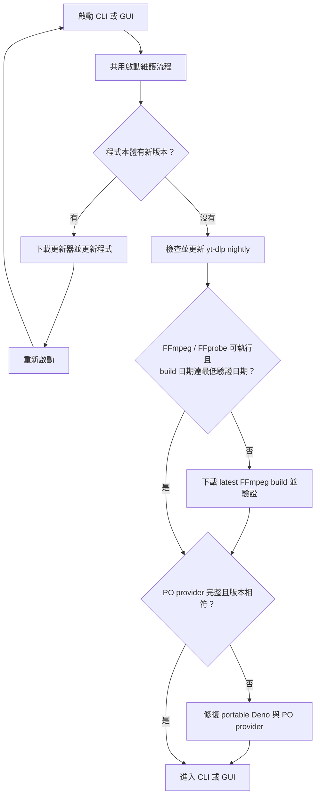

# YTDL - YouTube 影片下載工具

一個強大且易用的 YouTube 影片下載工具，提供命令列與圖形介面兩種模式，滿足您不同的下載需求。

## 主要功能

- **最高畫質**: 自動分析並下載合併為最佳畫質的影片 (最高支援 8K HDR)。
- **兩種模式**:
  - **命令列模式 (`YTDL.py`)**: 適合下載單一影片或整個播放清單/頻道。
  - **圖形介面模式 (`YTDL_mul.py`)**: 自動監控剪貼簿，方便快速批次下載多個影片。
- **智慧功能**:
  - **啟動維護**: 程式啟動時會檢查程式本身與 yt-dlp 更新，並驗證或修復 FFmpeg、portable Deno 與 YouTube PO Token provider。
  - **依賴自動安裝**: 首次執行時自動安裝所需 Python 套件 (`requests`、`pyperclip`)，開箱即用。
  - **斷點續傳**: 若上次下載中斷，下次啟動時會詢問是否繼續。
- **錯誤回報**: 內建 Discord Webhook 錯誤回報機制；回報含錯誤代碼、程式／系統版本、失敗網址或標題及診斷檔，便於開發者追查問題。

## 如何下載

1. 前往本專案的 [**Releases**](https://github.com/minhung1126/YTDL/releases) 頁面。
2. 在最新版本的 "Assets" 區塊中下載您需要的版本：
    - `YTDL.<版本號>.zip` — 原始碼 (`YTDL.py` + `YTDL_mul.py`)，需自行安裝 Python 與相依套件。

## 事前準備 (原始碼版)

1. **安裝 Python**: 請先確保您的電腦已安裝 [Python](https://www.python.org/downloads/) (建議版本 3.10 或以上)。
2. **安裝 yt-dlp**: 本工具依賴 `yt-dlp` 來執行下載。請參考 [官方指南](https://github.com/yt-dlp/yt-dlp#installation) 進行安裝。最簡單的方式是透過 `pip`：

    ```bash
    pip install -U yt-dlp
    ```

3. **安裝 FFmpeg**: 程式會在 `yt-dlp` 所在目錄尋找 `yt-dlp-ffmpeg.exe` 及 `yt-dlp-ffprobe.exe`。啟動檢查發現檔案無法執行、無法識別 build 日期，或低於最低驗證日期時，會從 [yt-dlp/FFmpeg-Builds](https://github.com/yt-dlp/FFmpeg-Builds) 下載最新 build 修復。
4. **安裝 Deno** *(可選)*: 若需要 Deno 相關功能，程式會在 `yt-dlp` 所在目錄尋找 `deno.exe`，更新時會自動下載。

## 啟動與可攜式工具流程

無論使用命令列或圖形介面，程式每次啟動都會先檢查程式本體與 `yt-dlp` 更新，再檢查可攜式 FFmpeg/FFprobe 與 provider 的本機完整性。provider 檢查涵蓋 plugin ZIP、Deno script、`node_modules`、版本標記與 portable Deno 是否存在；這些檢查不會向 YouTube 發出測試請求，也不會產生 PO Token。



首次使用、FFmpeg/FFprobe 缺失或無法執行、其 build 日期低於 `Config.FFMPEG_MIN_BUILD_DATE`、provider 版本不符或檔案不完整時，程式會呼叫 `self_update.py` 修復相應依賴。FFmpeg 會下載上游 `latest` build，並以最低驗證日期作為可用性門檻；provider 版本仍由 `Config.BGUTIL_POT_PROVIDER_VERSION` 手動維護。只有需要修復或版本不符時，才會下載並初始化：

   - `yt-dlp.exe` 同層的 `deno.exe`
   - `yt-dlp-plugins\bgutil-ytdlp-pot-provider.zip`
   - `bgutil-ytdlp-pot-provider\server\` 與其 Deno 依賴

PO Token 在實際下載 YouTube 影片時才會由 yt-dlp 透過 BgUtils script provider 產生；程式會傳入 `mweb` client、portable Deno 路徑與 provider 的 `server_home`。這個模式不使用 Docker、PowerShell 啟動腳本或常駐 HTTP server。provider 修復失敗時，下載會保留 yt-dlp 原有行為，並在日誌中記錄警告。

## 如何使用

### YTDL.py (命令列模式 - 單檔/播放清單/頻道下載)

此模式適合您想要下載特定一個影片、整個播放清單或頻道的場合。

1. 打開您的終端機 (例如: PowerShell、Command Prompt)。
2. 執行程式：

    ```bash
    python YTDL.py
    ```

3. 根據提示，貼上您想下載的 YouTube 影片、播放清單或頻道的網址，然後按下 Enter。
4. 程式將開始下載，完成的影片會儲存在同一個資料夾下。
   - 單一影片：儲存為 `標題.影片ID.mkv`
   - 播放清單/頻道：自動建立子資料夾 `播放清單名稱/標題.影片ID.mkv`

### YTDL_mul.py (圖形介面模式 - 剪貼簿監控批次下載)

此模式會啟動一個圖形介面，持續監控您的剪貼簿。當您複製 YouTube 網址時，它會自動加入待下載清單，非常適合快速收集並一次性下載多個來自不同地方的影片。

1. 直接雙擊 `YTDL_mul.py` 檔案，或在終端機中執行：

    ```bash
    python YTDL_mul.py
    ```

2. 程式會開啟一個視窗。點擊 **「開始偵測 | Start Detecting」** 按鈕。
3. 現在，您可以在瀏覽器或其他任何地方複製 YouTube 影片的網址。每複製一個，它就會自動出現在視窗的列表中。
4. 收集完所有您想下載的網址後，點擊 **「全部下載 | Download All」** 按鈕。
5. 程式會開始依序下載列表中的所有影片。

## 注意事項

- **首次執行**: 第一次執行任一腳本時，程式可能會花一點時間自動安裝 `requests` 和 `pyperclip` 等輔助套件，這是正常現象。
- **防火牆**: 首次執行時，您的作業系統防火牆可能會跳出提示，請允許程式存取網路以進行更新與下載。
- **錯誤回報**: 程式發生嚴重錯誤時會將錯誤代碼、程式／系統版本、失敗網址或影片標題，以及 yt-dlp 診斷輸出或 traceback 傳送到 Discord。回報不包含 Windows 使用者帳號或電腦名稱；若網址、標題或日誌可能含敏感內容，請勿使用來源不明的發行版本。
- **檔案格式**: 下載的影片統一使用 MKV 容器格式，內嵌字幕、縮圖及元數據。

## 專案架構

| 檔案 | 說明 |
|------|------|
| `YTDL.py` | 核心模組 — 命令列模式入口，包含下載邏輯、組態、錯誤處理及自動更新 |
| `YTDL_mul.py` | 圖形介面模式入口，匯入 `YTDL.py` 作為模組使用 |
| `self_update.py` | 更新腳本 — 負責更新程式檔案及可攜式依賴 (yt-dlp、FFmpeg、Deno、BgUtils PO Token provider) |

## 開發者指南

### 版本號

版本號定義於 `YTDL.py` 的 `__version__` 變數，格式為 `v{yyyy}.{mm}.{dd}.{index}`。

若專案根目錄存在 `.gitignore` 檔案 (即開發環境)，`__version__` 會自動設為 `"dev"`，以避免觸發自動更新機制。

### 二進位依賴版本

二進位工具的版本皆定義於 `YTDL.py` 中的 `Config` 類別：

| 設定 | 說明 |
|------|------|
| `YT_DLP_VERSION_CHANNEL` | yt-dlp 更新頻道 (目前: `nightly`) |
| `DENO_VERSION` | Deno 的固定版本號 |
| `FFMPEG_MIN_BUILD_DATE` | FFmpeg/FFprobe 最低驗證的 `YYYYMMDD` build 日期；低於此日期、無法執行或無法解析日期時會下載 latest build 修復 |
| `BGUTIL_POT_PROVIDER_VERSION` | BgUtils PO Token provider 的固定版本號 |

`self_update.py` 會讀取這些值；其中 FFmpeg 會下載上游 latest build，並驗證其日期不低於 `FFMPEG_MIN_BUILD_DATE`。

### 發布新版本

1. 修改 `YTDL.py` 中的 `__version__` 字串。
2. 推送 tag 即可觸發 GitHub Actions 自動建立 Release：

    ```bash
    git tag v2026.03.05.01
    git push origin v2026.03.05.01
    ```
