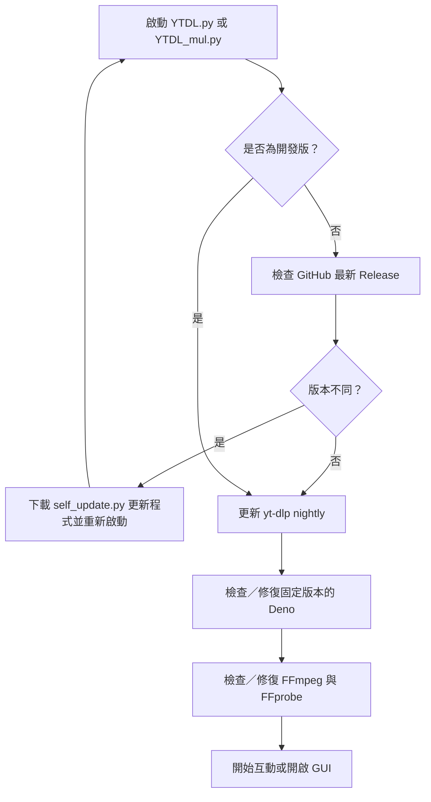

# YTDL

> Windows 向的 YouTube 下載器：以 Python 呼叫 [yt-dlp](https://github.com/yt-dlp/yt-dlp)，提供互動式命令列與剪貼簿批次圖形介面，並在啟動時維護 yt-dlp、FFmpeg 與 Deno。

YTDL 的目標是把下載流程做成「貼上網址即可開始」：先取得影片的中繼資料，再依既定規則選出相容的影音格式，最後以 MKV 合併影片、音訊、字幕、縮圖與常見元資料。它只接受結構正確的 YouTube 網址，避免將任意網站網址交給下載器。

> [!IMPORTANT]
> 請只下載您擁有權利、已獲授權或依法可保存的內容。使用者必須自行遵守 YouTube 服務條款、著作權法與所在地法律。

## 目錄

- [功能總覽](#功能總覽)
- [系統需求與準備](#系統需求與準備)
- [安裝與啟動](#安裝與啟動)
- [使用方式](#使用方式)
- [接受的網址](#接受的網址)
- [下載結果與格式策略](#下載結果與格式策略)
- [啟動維護、更新與可攜式依賴](#啟動維護更新與可攜式依賴)
- [中斷續傳與暫存檔](#中斷續傳與暫存檔)
- [錯誤、隱私與疑難排解](#錯誤隱私與疑難排解)
- [專案結構](#專案結構)
- [開發、測試與發布](#開發測試與發布)
- [限制與已知事項](#限制與已知事項)

## 功能總覽

| 功能 | 說明 |
| --- | --- |
| 命令列下載 | `YTDL.py` 以互動方式下載單支影片、播放清單或頻道／分頁。 |
| 剪貼簿批次下載 | `YTDL_mul.py` 提供 Tkinter 視窗，收集剪貼簿裡的 YouTube 網址後依序下載。 |
| 最高可用畫質 | 先以影片解析度、FPS、動態範圍等條件排序，再選擇相容影音軌；實際上限取決於來源提供的格式。 |
| MKV 封裝 | 影片與音訊合併為 MKV，並嘗試內嵌字幕、縮圖及中繼資料。 |
| 全部字幕 | 要求 yt-dlp 取得所有可用字幕，排除 `live_chat`，並嵌入輸出檔。是否有字幕仍取決於影片來源。 |
| 播放清單整理 | 播放清單／頻道會建立子資料夾；單支影片直接存到目前工作資料夾。 |
| 中斷後續作 | 下載前會把中繼資料存入 `meta/`；下次開啟時可選擇繼續未完成項目或捨棄佇列。 |
| 啟動維護 | 每次啟動會檢查程式更新、yt-dlp nightly、可攜式 Deno 及 FFmpeg／FFprobe。單一維護項目失敗時仍會保留 yt-dlp 的一般下載嘗試。 |
| 自動補齊 Python 套件 | 缺少 `requests` 時核心程式會透過 `pip` 安裝；GUI 缺少 `pyperclip` 時也會自動安裝。 |
| 失敗診斷 | 顯示可追蹤的錯誤代碼，並將完整 yt-dlp 輸出或 traceback 納入診斷回報。 |

## 系統需求與準備

本專案目前以 **Windows 11** 為主要執行環境；可攜式 Deno 的自動安裝也只為 Windows 實作。建議先準備：

| 項目 | 必要性 | 說明 |
| --- | --- | --- |
| Windows | 建議／自動維護必要 | 原始碼與更新流程使用 Windows `.exe` 檔名；Deno 自動安裝僅支援 Windows。 |
| Python 3.10+ | 必要 | 執行 `YTDL.py` 與 `YTDL_mul.py`。安裝時建議勾選 **Add Python to PATH**。 |
| `pip` | 必要 | 程式在缺少 Python 套件時會呼叫 `python -m pip install`。 |
| `yt-dlp` | 必要 | 實際擷取與下載工具，需可由命令列以 `yt-dlp` 執行。 |
| 網路連線 | 必要 | 用於影片下載與啟動時的更新／修復。 |
| FFmpeg + FFprobe | 建議且會自動維護 | 合併影音、嵌入字幕／縮圖／元資料所需；程式會管理與 yt-dlp 同目錄的可攜式版本。 |
| Deno | 自動維護 | 供 yt-dlp 處理部分 YouTube JavaScript challenge；程式會管理與 yt-dlp 同目錄的固定版本。 |
| `pyperclip` | 僅 GUI | 剪貼簿監控需要；首次開啟 GUI 時會嘗試自動安裝。 |

### 安裝 Python

從 [Python 官方下載頁](https://www.python.org/downloads/windows/) 安裝 Python 3.10 或更新版本。安裝完成後，重新開啟 PowerShell 並確認：

```powershell
python --version
python -m pip --version
```

若 `python` 找不到，可嘗試 Windows 的 Python Launcher：

```powershell
py --version
```

### 安裝 yt-dlp

在 PowerShell 執行：

```powershell
python -m pip install --upgrade yt-dlp
yt-dlp --version
```

若第二行顯示找不到 `yt-dlp`，請關閉並重新開啟 PowerShell，確認 Python 的 Scripts 目錄已在 `PATH` 中。也可依 [yt-dlp 安裝文件](https://github.com/yt-dlp/yt-dlp#installation) 使用其官方提供的安裝方式；重點是此專案執行時必須能找到 `yt-dlp` 指令。

### 首次執行的網路與權限提示

首次啟動或相依工具失效時，程式可能下載 Python 套件、Deno、FFmpeg／FFprobe，並檢查 yt-dlp 更新。防火牆、防毒或公司網路若攔截 Python、GitHub、Discord 或 yt-dlp 的連線，可能導致維護或下載失敗；請依組織規範授權所需連線，或改在允許的網路環境執行。

## 安裝與啟動

### 從 Release 取得原始碼版

1. 前往 [Releases](https://github.com/minhung1126/YTDL/releases)。
2. 展開最新版本的 **Assets**。
3. 下載 `YTDL.<版本>.zip`。
4. 解壓縮到一個您有寫入權限、且準備存放下載檔案的資料夾。
5. 依照前一節安裝 Python 與 yt-dlp。

目前 Release 產物是原始碼壓縮檔，內含 `YTDL.py` 和 `YTDL_mul.py`；不是獨立的 `.exe` 應用程式。

### 從原始碼執行

在專案資料夾開啟 PowerShell：

```powershell
cd D:\code\YTDL
python YTDL.py
```

開啟圖形介面：

```powershell
cd D:\code\YTDL
python YTDL_mul.py
```

您也可以用檔案總管直接開啟 `.py` 檔；不過建議第一次使用在 PowerShell 中執行，以便看見安裝、更新與錯誤訊息。輸出檔會寫入「啟動程式時的目前工作資料夾」，因此請先 `cd` 到想存放影片的位置。

### 虛擬環境（可選）

想把 Python 套件與系統環境隔離時，可建立虛擬環境：

```powershell
python -m venv .venv
.\.venv\Scripts\Activate.ps1
python -m pip install --upgrade pip yt-dlp
python YTDL.py
```

若 PowerShell 阻擋啟用指令碼，請依公司的執行原則處理，或直接以 `.venv\Scripts\python.exe YTDL.py` 執行。

## 使用方式

### 命令列模式：`YTDL.py`

這是最直接、也最適合單支影片、播放清單或頻道下載的模式。

```powershell
python YTDL.py
```

啟動完成後，依提示貼上網址，例如：

```text
Enter YouTube URL (or 'exit'): https://www.youtube.com/watch?v=VIDEO_ID
```

程式的處理順序如下：

1. 執行啟動維護。
2. 驗證網址是否為支援的 YouTube 格式。
3. 僅取得中繼資料，寫入 `meta/` 等待下載。
4. 對每個佇列項目選擇格式、下載並後處理。
5. 成功的項目會移除自己的 `.json` 中繼資料檔；所有項目完成後會刪除空的 `meta/` 資料夾。

輸入 `exit` 可結束程式。按下 `Ctrl+C` 可中斷目前命令列作業；尚未成功完成的項目會保留在暫存佇列中，下一次啟動時可選擇續作。

當程式發現 `meta/` 內仍有資料時，會顯示：

```text
Found temp files. Continue downloading? (Y/N)
```

- 輸入 `Y`：繼續下載目前佇列。
- 輸入 `N`：刪除整個未完成佇列。
- 輸入其他內容：程式結束，不會開始新下載。

### 圖形介面模式：`YTDL_mul.py`

圖形介面適合先收集多個網址、再依序下載：

```powershell
python YTDL_mul.py
```

主視窗出現前會先顯示「YTDL 準備中」小視窗，執行與命令列相同的啟動維護。完成後：

1. 按 **開始偵測 / Start Detecting**。
2. 在瀏覽器或其他程式複製 YouTube 網址。
3. 程式約每秒讀取一次剪貼簿，將新網址列到清單；相同字串的網址只會加入一次。
4. 按 **全部下載 / Download All**。
5. 程式先逐一取得所有網址的中繼資料，再逐一下載；視窗底部會顯示目前進度。

下載進行時，按鈕會暫時停用。關閉視窗時若下載仍在進行，程式會詢問是否離開；確認離開會要求背景工作停止，但已啟動的外部下載程序未必能立即終止，因此建議等待目前項目完成。

> [!NOTE]
> 圖形介面會在開始監測時清空剪貼簿，避免把舊內容誤加入清單；請先確定剪貼簿裡沒有尚未貼上的重要資料。

## 接受的網址

網址檢查只接受 `http` 或 `https` 的已知 YouTube 結構。下表列出目前程式碼接受的形式；實際內容能否下載仍由 YouTube 權限與 yt-dlp 決定。

| 類型 | 可接受範例 |
| --- | --- |
| 一般影片 | `https://www.youtube.com/watch?v=VIDEO_ID` |
| 短網址 | `https://youtu.be/VIDEO_ID` |
| Shorts、直播、嵌入與舊式 `/v/` | `https://youtube.com/shorts/VIDEO_ID`、`/live/VIDEO_ID`、`/embed/VIDEO_ID`、`/v/VIDEO_ID` |
| 無 Cookie 嵌入網址 | `https://www.youtube-nocookie.com/embed/VIDEO_ID` |
| YouTube Music 影片 | `https://music.youtube.com/watch?v=VIDEO_ID` |
| Clip | `https://youtube.com/clip/CLIP_ID` |
| 播放清單 | `https://www.youtube.com/playlist?list=PLAYLIST_ID`、YouTube Music 的 `/playlist?list=…` |
| 頻道及分頁 | `/channel/ID`、`/c/名稱`、`/user/名稱`、`/@handle`，以及其 `featured`、`videos`、`shorts`、`streams`、`live`、`playlists`、`community` 分頁 |

下列常見網址會被拒絕：搜尋結果、一般頻道外的任意路徑、缺少 `v` 的 `/watch`、缺少 `list` 的 `/playlist`、非 YouTube 網域、`ftp://` 等非 HTTP(S) 網址。請貼上完整影片、播放清單或頻道網址，而不是搜尋頁網址。

## 下載結果與格式策略

### 檔案位置與命名

| 來源 | 輸出路徑樣式 |
| --- | --- |
| 單支影片 | `標題.影片ID.mkv` |
| 播放清單或頻道 | `播放清單名稱/標題.影片ID.mkv` |

播放清單資料夾名稱會移除 Windows 不允許的字元（例如 `<>:"/\\|?*`）、控制字元與尾端句點／空白；若名稱是 Windows 保留字（如 `CON`、`NUL`、`COM1`），程式會自動加上底線。這可降低因來源標題造成存檔失敗的機率。

### 固定的 yt-dlp 行為

每個下載會要求：

- 以 `--merge-output-format mkv` 合併輸出為 **MKV**。
- 以 `--embed-subs --sub-langs all,-live_chat` 內嵌所有可用字幕，但排除即時聊天室字幕。
- 以 `--embed-thumbnail --embed-metadata` 內嵌縮圖與元資料。
- 以 `--force-ipv4` 建立 IPv4 連線。
- 使用 `--concurrent-fragments 2` 同時下載分段，並以兩秒間隔回報進度。
- 透過 `FFmpeg:-nostdin` 避免 GUI／背景程序的 FFmpeg 等待主控台輸入。
- 以 `--verbose` 取得足供診斷的詳細輸出。

若影片來源未提供字幕、縮圖、可合併的影音軌或特定解析度，輸出會以來源可用內容為準；這些選項不會憑空產生不存在的內容。

### 格式選擇規則

程式先讀取中繼資料中的可用格式，不是單純交給 yt-dlp 以預設排序。可配對的候選組合依下列優先順序選擇：

1. 較高解析度。
2. 相同解析度下較高 FPS。
3. 相同解析度與 FPS 下較高動態範圍：`HDR12`、`HDR10+`、`HDR10`、`HLG`、`SDR`；Dolby Vision 會保留較低的相容性優先序。
4. 視覺條件相同時，編碼家族依序為 **VP9 + Opus**、**AVC/H.264 + M4A**、**AV1 + Opus**。
5. 再偏好較直接的傳輸協定（例如 HTTPS 優於 HLS）。
6. 音訊方面偏好非 DRC、更多聲道、較高取樣率與位元率的相容音軌。

若沒有任何上述相容影音組合，程式會退回 yt-dlp 的 `bv+ba` 格式選擇，排序條件為解析度、FPS、HDR 與傳輸協定。這代表「最高畫質」是依此策略與來源可用格式決定，不保證每個來源都有 4K、8K、HDR 或指定編碼。

### 播放清單中繼資料

下載播放清單項目時，程式會保留播放清單名稱、識別碼、網址、索引及其他取得到的播放清單欄位，並設定專輯／曲目相關中繼資料。各播放器顯示方式仍取決於 MKV 支援度與播放器本身。

## 啟動維護、更新與可攜式依賴

命令列與 GUI 共用同一段啟動維護邏輯：



### 程式本體更新

非開發版會從 GitHub Releases 比較目前 `__version__` 與最新 tag。發現不同時，會下載 `self_update.py`、抓取最新 Release 原始碼，更新目前工作資料夾中的 `YTDL.py`，若原本有 `YTDL_mul.py` 也一併更新，然後重新啟動呼叫它的腳本。

**開發環境例外：** 專案根目錄存在 `.gitignore` 時，`YTDL.py` 會把執行時版本設為 `dev` 並略過程式本體更新，避免工作樹被自動覆寫。這不會略過 yt-dlp、Deno 或 FFmpeg 的檢查。

### yt-dlp、Deno 與 FFmpeg

| 元件 | 維護方式 | 安裝／檢查位置 |
| --- | --- | --- |
| yt-dlp | 每次啟動執行 `yt-dlp --update-to nightly`；失敗僅記錄錯誤。 | 必須先能由 `PATH` 執行。 |
| Deno | 確認版本完全等於 `Config.DENO_VERSION`；否則下載 Windows x64 可攜版。 | 與 `yt-dlp.exe` 同一資料夾，檔名 `deno.exe`。 |
| FFmpeg / FFprobe | 確認兩個檔案都可執行，且 build 日期不低於設定門檻；否則下載 latest build。 | 與 `yt-dlp.exe` 同一資料夾，檔名 `yt-dlp-ffmpeg.exe`、`yt-dlp-ffprobe.exe`。 |

下載 YouTube 內容時，若可攜式 Deno 可用，程式會把它透過 yt-dlp 的 `--js-runtimes deno:<路徑>` 傳入，以協助處理 JavaScript challenge。若 Deno 修復或驗證失敗，程式仍會嘗試不帶該 runtime 的 yt-dlp 流程。

> [!WARNING]
> `yt-dlp --update-to nightly` 是否可更新取決於您當初安裝 yt-dlp 的方式。若以 pip 安裝而更新失敗，請手動執行 `python -m pip install --upgrade yt-dlp`。程式不會自動把 yt-dlp 安裝到系統中。

## 中斷續傳與暫存檔

在真正下載檔案前，程式會將每個網址的資訊寫入程式資料夾下的 `meta/`。這個資料夾是待下載佇列，不是輸出資料夾。

| 狀態 | `meta/` 行為 |
| --- | --- |
| 成功取得中繼資料 | 為每個內容建立一個 `.json` 項目。 |
| 單一影片下載成功 | 刪除該影片的 `.json` 項目。 |
| 下載失敗／中斷 | 保留 `.json`，讓下次啟動時能續作。 |
| 所有項目成功 | 移除空的 `meta/` 資料夾。 |
| 使用者拒絕續作 | CLI 會刪除整個 `meta/`；GUI 也會在對話框中選取消時嘗試刪除。 |

若確定不需要恢復任何下載，可以在程式完全關閉後手動刪除專案資料夾中的 `meta/`。這會丟棄未完成佇列，但不會刪除已輸出的影片檔。

## 錯誤、隱私與疑難排解

### 錯誤回報內容

程式對重大錯誤會產生類似 `ERR-YYYYMMDD-HHMMSS-ABC123` 的錯誤代碼；更新器使用 `UPD-…` 前綴。錯誤摘要會出現在主控台或 GUI 訊息中。程式內建的 Discord Webhook 會嘗試回傳：

- 錯誤代碼、錯誤類型、作業名稱與程式／Windows 版本；
- 發生問題的網址與影片標題（若程式已取得）；
- yt-dlp 完整輸出或 Python traceback，作為附加診斷文字檔；
- 若診斷內容超過 8 MiB，僅保留最後一段內容並標記截斷。

程式刻意不蒐集 Windows 使用者帳號或電腦名稱；但**網址、影片標題、yt-dlp 日誌與 traceback 仍可能含有您不想外傳的資訊**。若這對您的情境不可接受，請勿執行含有該 Webhook 的版本，並自行檢閱／修改原始碼後再使用。

### 常見問題

| 現象 | 可能原因與處理方式 |
| --- | --- |
| `Executable not found: yt-dlp` | 安裝或重新安裝 yt-dlp：`python -m pip install --upgrade yt-dlp`；重開 PowerShell 後確認 `yt-dlp --version` 可執行。 |
| 啟動時自動安裝套件失敗 | 檢查 Python、pip、網路與寫入權限；可手動執行 `python -m pip install requests pyperclip`。CLI 只需要 `requests`，GUI 另需要 `pyperclip`。 |
| FFmpeg／Deno 修復失敗 | 檢查是否能連上 GitHub、是否有寫入 yt-dlp 所在資料夾的權限，以及防毒是否隔離 `.exe`。即使修復失敗，程式仍可能嘗試下載，但合併與嵌入功能可能失效。 |
| yt-dlp nightly 更新失敗 | 手動執行 `python -m pip install --upgrade yt-dlp`，或依 yt-dlp 官方安裝方式更新。 |
| 顯示 `Invalid URL` | 請貼上本文件「接受的網址」中列出的完整 YouTube 網址；搜尋頁、頻道首頁以外的任意頁面與非 YouTube 網址會被拒絕。 |
| 私人、年齡限制、會員專屬或已刪除影片 | 程式會分別辨識常見訊息；需要登入、年齡驗證或會員權限的內容不保證可下載。此專案目前沒有提供 Cookie／帳號登入設定介面。 |
| 沒有字幕、縮圖或最高解析度 | 來源本身可能未提供；檢查相同影片在 YouTube 的可用內容，並確認 FFmpeg 可用。 |
| 下載看似停住 | 大型影片、後處理、網路節流或來源限制都可能造成長時間等待。程式每 60 秒會在日誌留下 heartbeat；請查看 yt-dlp 的最後輸出與錯誤代碼。 |
| 輸出找不到 | 檢查您啟動命令前所在的資料夾；單支影片直接輸出在該資料夾，播放清單／頻道位於子資料夾。 |

若需要回報問題，請提供錯誤代碼、執行方式（CLI 或 GUI）、是否可重現、已嘗試的處理方式，以及去除敏感資訊後的最後幾行輸出。請勿公開貼出私人網址、Cookie、帳號資訊或 Discord Webhook。

## 專案結構

| 路徑 | 用途 |
| --- | --- |
| `YTDL.py` | 核心模組與命令列入口：網址檢查、格式挑選、佇列、下載、錯誤處理與啟動維護。 |
| `YTDL_mul.py` | Tkinter 圖形介面入口：剪貼簿監控、批次佇列與下載進度。 |
| `self_update.py` | 程式本體、可攜式 Deno、FFmpeg／FFprobe 的下載與修復腳本。 |
| `tests/test_youtube_url_parsing.py` | 支援與拒絕的 YouTube 網址格式測試。 |
| `tests/test_preferred_format_selector.py` | 格式配對與排序策略測試。 |
| `.github/workflows/auto-release.yml` | 版本 tag 推送後建立 GitHub Release 與原始碼 zip 的流程。 |
| `meta/` | 執行期間產生的未完成下載中繼資料；已由 `.gitignore` 排除。 |

## 開發、測試與發布

### 本機測試

專案使用 Python 標準函式庫的 `unittest`。在專案根目錄執行：

```powershell
python -m unittest discover -s tests -v
```

提交前至少執行語法檢查：

```powershell
python -m py_compile YTDL.py YTDL_mul.py self_update.py
```

再執行測試：

```powershell
python -m unittest discover -s tests -v
```

### 版本規則

版本來源在 `YTDL.py` 的 `__version__`，格式為：

```text
vYYYY.MM.DD.NN
```

例如 `v2026.07.22.02`。只有建立 Release 時才需要調整版本號。注意：開發樹只要存在 `.gitignore`，執行時會覆寫為 `dev`，這是為了關閉自動更新，並不代表原始碼中的發布版本號應寫成 `dev`。

### 二進位設定

`YTDL.py` 的 `Config` 集中定義與相依工具相關的值：

| 設定 | 作用 |
| --- | --- |
| `YT_DLP_VERSION_CHANNEL` | yt-dlp 更新頻道；目前為 `nightly`。 |
| `DENO_VERSION` | 要求的可攜式 Deno 版本。 |
| `FFMPEG_MIN_BUILD_DATE` | 可接受的 FFmpeg／FFprobe 最低 build 日期，格式為 `YYYYMMDD`。 |
| `CONCURRENT_FRAGMENTS` | 傳給 yt-dlp 的同時分段下載數；目前為 `2`。 |
| `PROGRESS_BAR_SECONDS` | 傳給 yt-dlp 的進度更新間隔；目前為 `2` 秒。 |
| `SUBPROCESS_HEARTBEAT_SECONDS` | 外部程序未結束時記錄 heartbeat 的間隔；目前為 `60` 秒。 |

調整這些值可能影響相容性、網路負載或維護行為；變更後應執行語法檢查與測試。`ytdl/` 資料夾刻意保持空白，請勿移除或加入 `__init__.py`。

### 發布新版本

GitHub Actions 會在推送 `v*` tag（或手動觸發工作流程）時，讀取 `YTDL.py` 的版本字串、建立 `YTDL.<版本>.zip`，並建立 GitHub Release。

建議流程：

```powershell
python -m py_compile YTDL.py YTDL_mul.py self_update.py
python -m unittest discover -s tests -v
git add YTDL.py YTDL_mul.py self_update.py README.md
git commit -m "Release v2026.07.22.02"
git tag v2026.07.22.02
git push origin main
git push origin v2026.07.22.02
```

請先確認 `YTDL.py` 的 `__version__` 與 tag 完全一致，再推送 tag。Release zip 目前只包含 `YTDL.py` 與 `YTDL_mul.py`；使用者仍需自行準備 Python 與 yt-dlp。

## 限制與已知事項

- 這不是通用網站下載器；目前只驗證並接受特定的 YouTube／YouTube Music／YouTube NoCookie 網址結構。
- 沒有命令列選項或 GUI 設定面板可選 MP3、MP4、指定解析度、下載目錄、Cookie、Proxy 或登入帳號；輸出策略固定為上述 MKV 流程。
- 私人影片、付費會員內容、年齡限制、地區限制、直播內容與 YouTube 的反自動化機制，可能令下載無法完成。Deno 是輔助 runtime，不是保證繞過存取限制的方法。
- 播放清單與頻道可能很大，程式會先抓取中繼資料再開始下載；請預留足夠的網路流量、時間與磁碟空間。
- GUI 的剪貼簿偵測依賴 `pyperclip` 與作業系統剪貼簿權限；遠端桌面、安全軟體或特殊剪貼簿工具可能影響偵測。
- Windows 以外環境未列為支援目標，尤其 Deno 可攜式自動安裝會失敗；若要在其他作業系統使用，請自行管理 yt-dlp、Deno、FFmpeg／FFprobe，並測試相容性。

## 授權與上游專案

本專案的實際下載能力仰賴 [yt-dlp](https://github.com/yt-dlp/yt-dlp)、[FFmpeg](https://ffmpeg.org/) 與 [Deno](https://deno.com/)。使用、散布或修改時，請同時遵守本專案與上述上游專案各自的授權條款。
